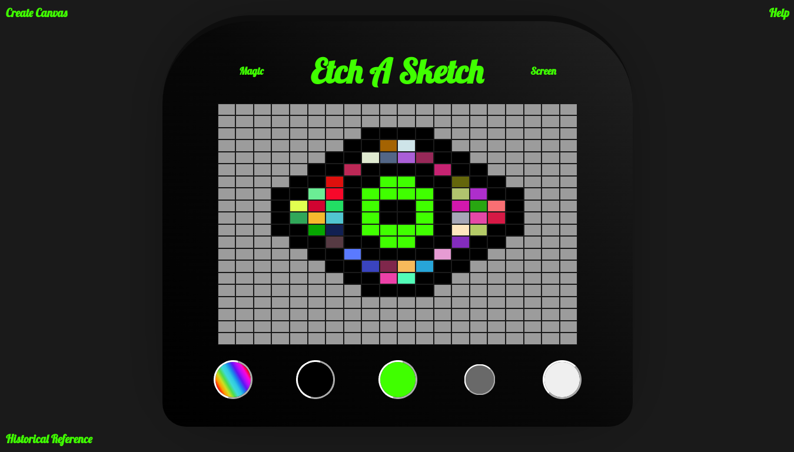
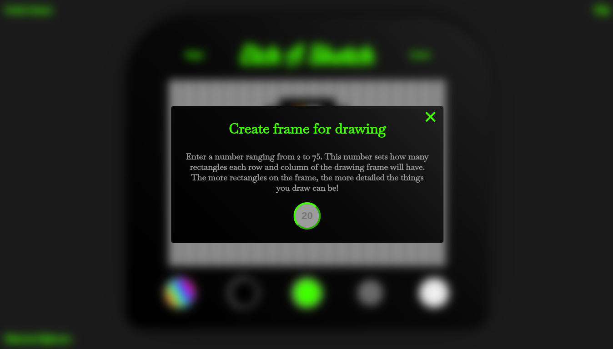
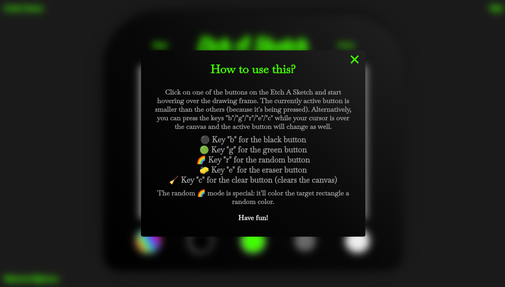

## Etch A Sketch

This is a very simple Etch A Sketch web application built with Vanilla JavaScript, HTML and CSS. Despite its simplicity, it was valuable for me to reinforce key concepts of DOM Manipulation, like capturing/bubbling/event delegation, the difference between the event pairs (mouseenter, mouseleave) and (mouseover, mouseout), iterating over NodeLists/HTML Collections, DOM traversing, manipulating inline styles and classlists through JS, systematic insertion of HTML, callback functions, a couple of important array methods, etc. I also included some modal windows for practicing purposes, since adding/removing visibility/activation classes with JS is a crucial and recurrent pattern.

Regarding CSS and styling, I put some effort into making it mobile-friendly and responsive accross multiple screensizes (mainly by using (or maybe overusing?) clamp all over the place) but it could definitely be better. No assets were provided beforehand and the whole code is mine, even though I've taken a look at similar projects for design inspiration.

You can see it [LIVE](https://oczywsziysya-etch-a-sketch.netlify.app/) here.

### Screenshots

